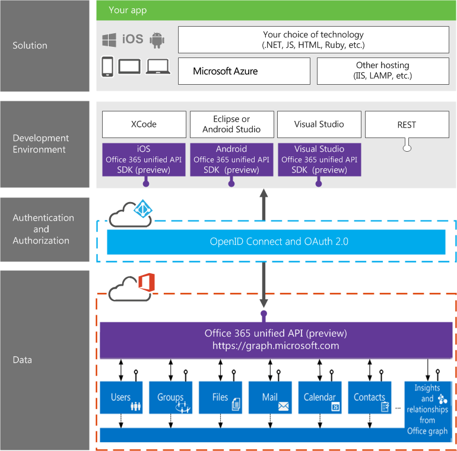

# Microsoft Graph API overview 
 
_**Applies to:** Office 365_
 
>  Your feedback is important to us. Connect with us on [Stack Overflow](http://stackoverflow.com/questions/tagged/office365). Tag your questions with [office365].

**In this article**
  
-	[Overview of Microsoft Graph API](#msg_what_is_unified_api) 
-	[Learn more about  Microsoft Graph API development](#msg_how_learn_unified_api) 

## Overview of Microsoft Graph API

The Microsoft Graph API (also called Office 365 unified API during the preview) exposes multiple APIs from Microsoft cloud services through a single REST API endpoint. Using the Microsoft Graph API, you can turn your formerly difficult or complex queries into simple navigations. 

The API exposes information about entities and the relationships among them through one REST URL namespace (_https://_**graph.microsoft.com**), using one authentication and authorization system, and using a consistent and unified metadata, payload format, error handling, library, and more.
 
The Microsoft Graph API exposes fixed entities like users, groups, mail, messages, calendars, tasks, notes coming from services like Outlook, OneDrive, Azure Active Directory, Planner, OneNote and others. It also exposes calculated relationships powered by the Office Graph (only for commercial users) like the list of users you are working with or the documents trending around you.

<!-- 
It takes information that is stored or inferred across multiple cloud services: 
-	exposing them through one REST URL namespace. The unifying URL namespace is _https://_**graph.microsoft.com**
-	using one authentication and authorization system
-	using a consistent and unified metadata, payload format, error handling, library, and more

through one REST URL namespace (https://graph.microsoft.com), using one authentication and authorization system, and using a consistent and unified metadata, payload format, error handling, library, and more.  -->

## Calling Office 365 APIs vs Microsoft Graph API

Let's say you want to programmatically retrieve a user's files, profile picture, and find the manager of the person who last edited that file in your organization. Because the information is stored in  multiple services-Azure Active Directory, SharePoint, and Exchange-the task involves multiple steps using Office 365 APIs: 

1. Use the Discovery Service to find the various service endpoints 
2. Determine the URL of the services your Office 365 apps want to connect to
3. Then acquire and manage the access token for each service and make the request to the service directly

Now, you can use the use Microsoft Graph API to perform the same complex operation via a single REST API endpoint. You don't have to discover and navigate a different endpoint for each service, acquire and manage separate access token for each service, deal with siloed services and varying data model.

<!--discover and navigate a different endpoint for each service
-	acquire and manage separate access token for each service
-	deal with siloed services and varying data model.  Currently each service defines entities independent of each other -->

The following diagram shows the Microsoft Graph API developer stack and how it works.

## Learn more about Microsoft Graph API development

The following resources can help you get started:

**Develop an app using Microsoft Graph API**

-  [Get started with the Microsoft Graph API](\microsoft-graph-api-FAQs.md) 
-  [Microsoft Graph API FAQs](\microsoft-graph-api-FAQs.md) 
-  [Authorization Code Grant Flow](https://msdn.microsoft.com/en-us/library/azure/dn645542.aspx)

<!--
-  [Get started with the Office 365 unified API (preview)](..\howto\get-started-with-office-365-unified-api.md) 
-  [Office 365 unified API in depth (preview)](..\howto\office-365-unified-api-in-depth.md) 
-  [Examples of Office 365 unified API calls (preview)](..\howto\examples-of-office-365-unified-api-calls.md) 
-  [Develop with the Office graph](https://msdn.microsoft.com/office/office365/howto/develop-office-graph)
-  [Cross-origin resource sharing (CORS) support](..\howto\create-web-apps-using-CORS-to-access-files-in-Office-365.md) 
 -->
 
**Try out and explore the Microsoft Graph API**

-  [Microsoft Graph API Explorer](https://graphexplorer2.azurewebsites.net/) 
-  [API Sandbox](http://apisandbox.msdn.com)

**Hands on lab**

-  [Deep dive into the Microsoft Graph API](http://dev.office.com/hands-on-labs/4585)

**Code samples**

-  [Single page app sample](https://github.com/OfficeDev/O365-Angular-Profile)
-  [.NET app sample](http://aka.ms/o365-win-profile)
-  [Android app sample](http://aka.ms/o365-android-profile)
-  [iOS app sample](http://aka.ms/o365-iOS-profile)

**Release notes and known issues for Office 365 unified API**

-  [Microsoft Graph API release notes for November 2015](\microsoft-graph-api-release-notes-known-issues.md)

**Reference**

- [Examples of Office 365 unified API calls (preview)](..\howto\examples-of-office-365-unified-api-calls.md)
- [Office 365 Groups REST API reference (preview)](..\howto\groups-rest-operations.md) 
- [Office 365 unified API reference (preview)](..\howto\office-365-unified-api-reference.md)

**Client libraries** 

-  [Android](https://github.com/OfficeDev/Office-365-SDK-for-Android)
-  [iOS](https://github.com/OfficeDev/Office-365-SDK-for-iOS)
-  [.NET library](https://www.nuget.org/packages/Microsoft.Graph)
  

