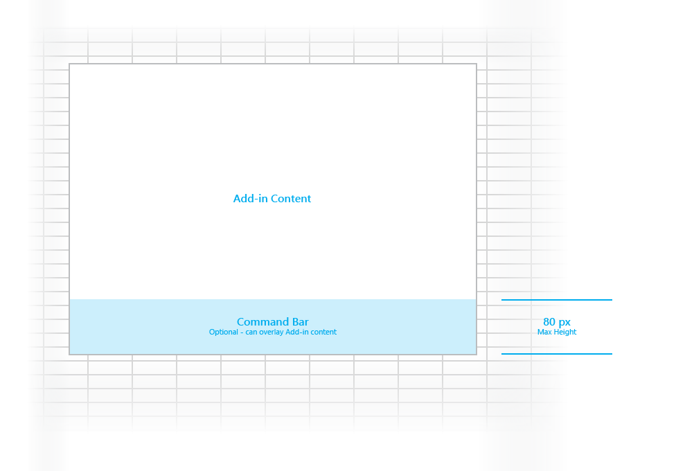

##Layout for content add-ins

Create a consistent look and feel for your content add-ins by using the recommended design layout. The recommended layout for a content add-in includes the following elements: 

- Add-in content
- Command bar (optional) - Includes icons or navigation for users, and can overlay the add-in content. The maximum height is 80 pixels.

You can also add [custom HTML-based UI](UIElements.md#custom-HTML-based-UI) to your content add-in.

### Full Sample template
[http://foo](http://foo "Download") [**Todo**: Humberto to create sample]

###Individual Building Blocks

- [Command Bar](http://foo)
- [Input, layout components](http://foo)
 