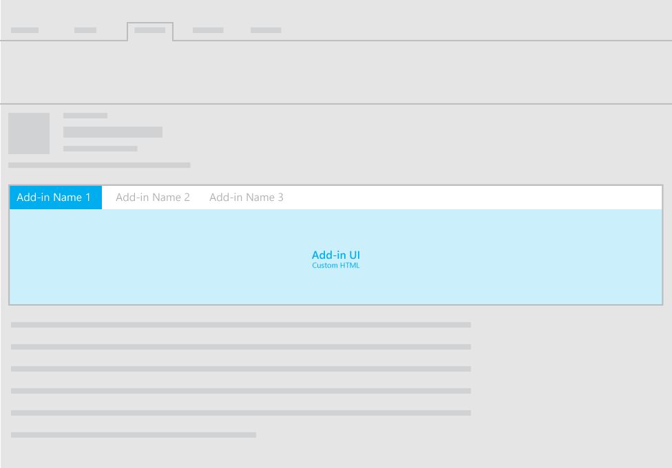
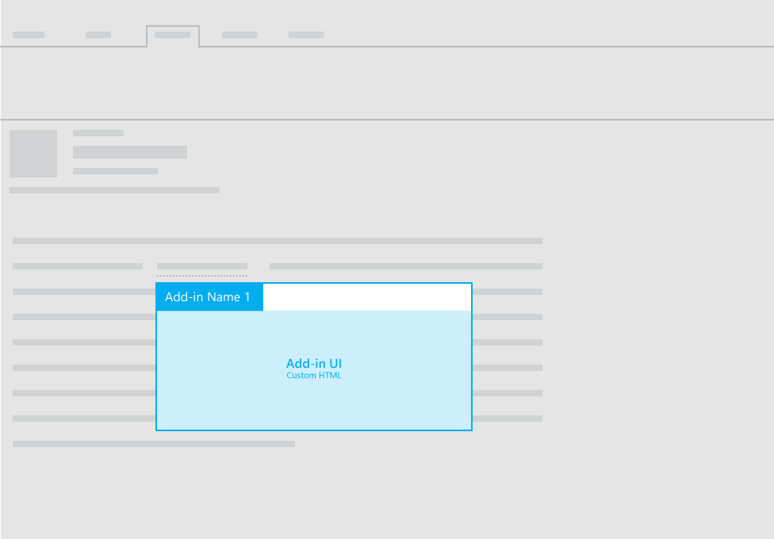

#Layouts for mail add-ins

**Last modified:** September 23, 2015

***Applies to:** Access apps for SharePoint | apps for Office | Excel | Office Add-ins | Outlook | PowerPoint | Project | Word*

Learn more about [supported hosts and other requirements](https://msdn.microsoft.com/EN-US/library/office/dn833104.aspx).

You can use any of the following layouts for mail add-ins:

- Task pane
- Custom pane (horizontal or contextual)
- Functions with InfoBar notifications

For guidelines about UI text in your add-ins, see [Office Voice](Voice.md).

##Task pane
 For recommendations for task pane layouts for mail add-ins, see [Layout for task pane add-ins](TaskpaneAddin.md).

##Custom pane

The following image shows the recommended layout for a custom pane in a mail add-in.

The following image shows the recommended layout for a [contextual mail add-in](https://msdn.microsoft.com/EN-US/library/office/dn893542.aspx).

##Functions with InfoBar notifications

In addition to using a task pane or custom pane to display custom HTML UI in your mail add-in, you can execute functions from commands. When you need to display UI text as a result of a function, you can use InfoBar notifications. For example, you might need to use an InfoBar notification to display error or success messages. 

For more information, see [add-in commands for mail](https://msdn.microsoft.com/EN-US/library/office/mt267546.aspx). 

