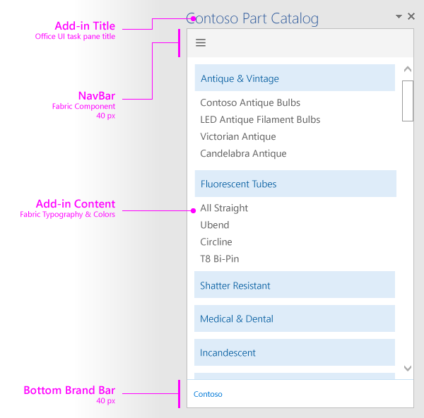

#Layout for task pane add-ins

**Last modified:** December 4, 2015

***Applies to:** Access apps for SharePoint | apps for Office | Excel | Office Add-ins | Outlook | PowerPoint | Project | Word*

Learn more about [supported hosts and other requirements](https://msdn.microsoft.com/EN-US/library/office/dn833104.aspx).

Create a consistent look and feel for task pane add-ins by using the recommended design layout. The recommended layout for a task pane add-in includes the following elements: 

- Navigation element (optional) - Include a navigation bar or pivot in a bar under the brand element, if you're using one, with a maximum height of 80 pixels.
- Add-in content
- Branding element (optional)

You can also add [custom HTML-based UI](UIElements.md#custom-HTML-based-UI) to your task pane add-in.

For a sample that shows how to use Office UI Fabric in Office Add-ins, see [Office Add-in Fabric UI Sample](https://github.com/OfficeDev/Office-Add-in-Fabric-UI-Sample).

<!-- Add sample template for content add-in and individual building blocks - Branding, Navigation bar or pivot, input, layout components -->
