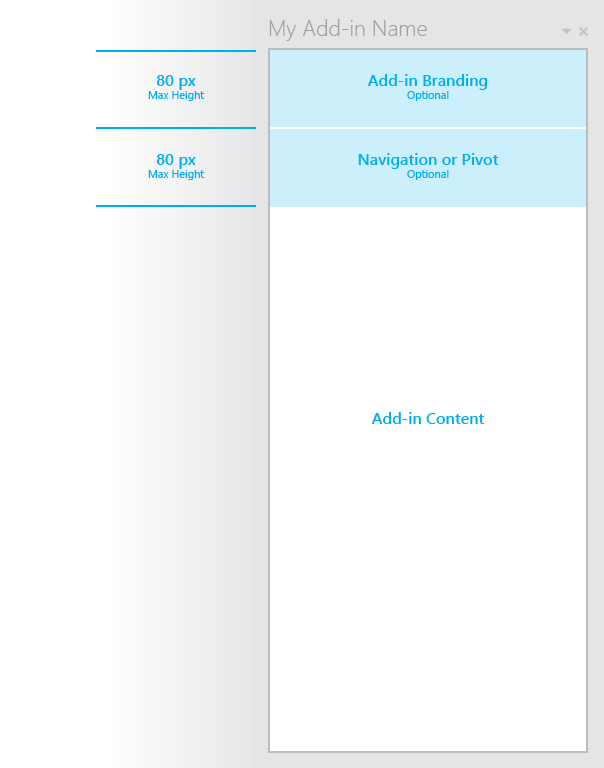

#Layout for task pane add-ins

Create a consistent look and feel for task pane add-ins by using the recommended layout. A task pane add-in includes the following elements: 

- Branding (optional) Include in a bar at the topic, with a maximum height of 80 pixels.
- Navigation element (optional) Include a navigation bar or pivot in a bar under the brand element, if you're using, with a maximum height of 80 pixels.
- Content

You can also add [custom HTML-based UI](UIElements.md#custom-HTML-based-UI) to your task pane add-in.

### Full Sample template
[http://foo](http://foo "Download")
[**Todo**: Humberto to create sample]

###Individual Building Blocks

- [Branding header](http://foo)
- [Navigation Bar or Pivot](http://foo)
- [Input, layout components](http://foo)
[**Todo**: Humberto to change links to point to samples]