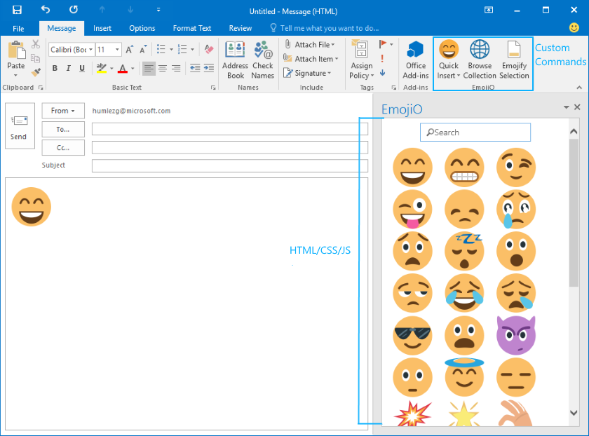
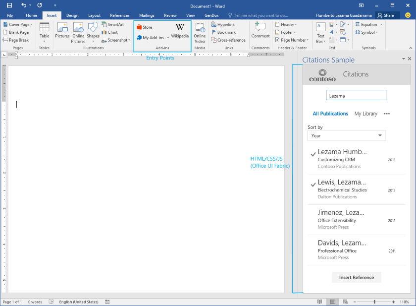

#Office Add-in UI elements

**Last modified:** September 3, 2015

***Applies to**: Access apps for SharePoint | apps for Office | Excel | Office Add-ins | Outlook | PowerPoint | Project | Word*

Learn more about [supported hosts and other requirements](https://msdn.microsoft.com/EN-US/library/office/dn833104.aspx).

You can use two types of UI elements in your Office Add-ins: 

- Add-in commands 
- Custom HTML-based interfaces

 

##Add-in commands
Commands are defined in the [add-in XML manifest](https://msdn.microsoft.com/EN-US/library/office/mt267547.aspx) and are rendered as native UX extensions to the Office UI. For example, you can use commands to add buttons to the Office Ribbon. 

Currently, add-in commands are only supported for mail add-ins. To learn more, see [Add-in commmands for mail](https://msdn.microsoft.com/EN-US/library/office/mt267546.aspx?f=255&MSPPError=-2147217396). The image below shows an [emoji sample](https://github.com/LezaMax/emoji) add-in.
 

Excel, PowerPoint, and Word have predefined entry points for task pane and content add-ins on the Insert tab in the Office ribbon. Custom command functionality for content and task pane add-ins will be available soon. 

##Custom HTML-based UI
Add-ins can embed custom HTML-based UI within Office clients. The containers that are available to display the UI vary based on the type of add-in. For example, task pane add-ins display custom HTML-based UI in the right pane of the document; content add-ins display the custom UI directly within Office documents.

Regardless of the type of add-in you create, you can use common building blocks to create custom HTML-based UI. We recommend that you use Office UI Fabric for these UI elements so that your add-in integrates with the Office look and feel. You are also welcome to use your own UI elements to express your own brand.

Office UI Fabric provides the following UI elements:

- [Typography](https://github.com/OfficeDev/Office-UI-Fabric/blob/master/ghdocs/FEATURES.md#typography)
- [Color](https://github.com/OfficeDev/Office-UI-Fabric/blob/master/ghdocs/FEATURES.md#color)
- [Icons](https://github.com/OfficeDev/Office-UI-Fabric/blob/master/ghdocs/FEATURES.md#icons)
- [Animations](https://github.com/OfficeDev/Office-UI-Fabric/blob/master/ghdocs/FEATURES.md#animations)
- [Input components](https://github.com/OfficeDev/Office-UI-Fabric/blob/master/ghdocs/COMPONENTS.md#inputs)
- [Layouts](https://github.com/OfficeDev/Office-UI-Fabric/blob/master/ghdocs/COMPONENTS.md#layout) 
- [Navigation elements](https://github.com/OfficeDev/Office-UI-Fabric/blob/master/ghdocs/COMPONENTS.md#navigation)

For a sample that shows how to use Office UI Fabric in Office Add-ins, see [Office Add-in Fabric UI Sample](https://github.com/OfficeDev/Office-Add-in-Fabric-UI-Sample).

**Note:** If you decide to use your own set of fonts and icons, make sure they don't conflict with those of Office. For example, don't use icons that are the same as or similar to those in Office, but represent something different in your add-in. 

###Creating a customized color palette
If you decide to use your own color palette, keep the following in mind: 
 
- Use color to help communicate your brand value to users, and to add emotion and delight to your add-in user experience.
- Use color meaningfully and consistently in your add-in. For example, choose one color as an accent to give your add-in a consistent visual theme.
- Avoid using the same color for both interactive and non-interactive elements. If you use color to indicate items users can interact with, such as navigation, links, and buttons, don't use the same color for static items.
- If you use color for text or white text on a colored background, be sure that your colors have enough contrast to meet accessibility guidelines (4.5:1 contrast ratio).
- Be aware of color blindness —- use more than just colors to indicate interactivity.

###Theming 
Whether you decide to adopt the Office color scheme or to use your own, we encourage you to use our Theming APIs. Add-ins that are part of the Office theming experience will feel much more integrated with Office.

- For mail and task pane add-ins, use the [Context.officeTheme](https://msdn.microsoft.com/EN-US/library/office/mt455203.aspx) property to match the theme of the Office applications. This API is currently only available in Office 2016.  
- For PowerPoint content add-ins, see [Use Office themes in your PowerPoint add-ins](https://msdn.microsoft.com/EN-US/library/office/dn864586.aspx).

<!-- Link to theming API docs and Humberto's seed sample. Add screenshot of themed add-in. -->

